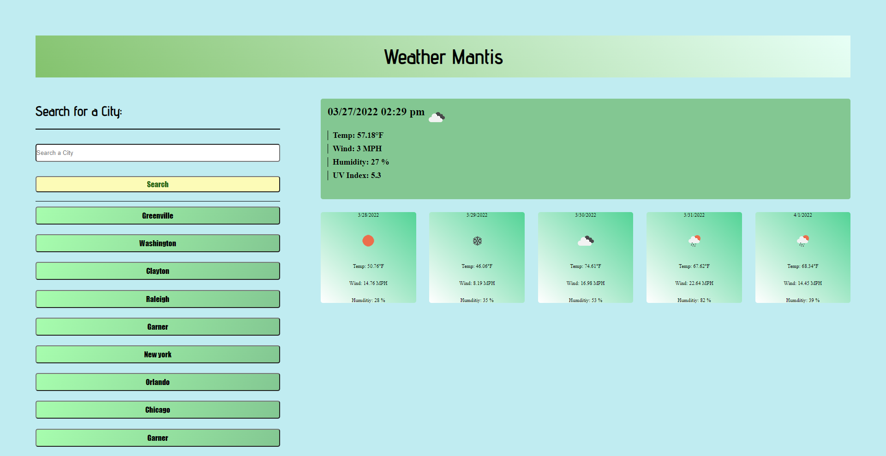

# Weather Mantis

## Goal for this project
A weather dashboard for users to search cities and view their forecasts. Searched cities will also be saved, and you'll be able to revisit the page for further viewing.  

### Current Forecast Stats:
* **Temp**
* **Wind**
* **Humidity**
* **UV Index**

### Weekly Forecast Stats:
* **Temp**
* **Wind**
* **Humidity**

[Click this sentence to visit the web app!](https://malikspruill.github.io/weather-mantis/)

 

## Technologies Used
JavaScript
CSS
date-fns

## Contributions
Malik Spruill